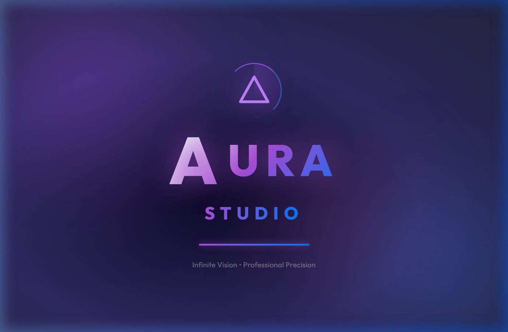

# 🌌 AURA Studio : Infinite Creative Suite

<p align="center">
  
</p>

---

<p align="center">
  
  
  
  
</p>

---

## 🎨 Mastery of the Infinite Canvas

AURA Studio is not just a drawing tool; it is a **Cinematic Creative Environment**. Engineered for precision and inspired by the infinite, AURA provides a boundless stage for your most ambitious visions.

### 💎 The AURA Advantage

*   🚀 **Infinite Workspace**: Break free from the boundaries of standard worksheets. Our canvas expands as far as your imagination.
*   🖌️ **Magic Pen (Auto-Draw)**: Sketch naturally and watch our intelligent engine refine your strokes into perfect geometric forms.
*   📐 **Precision 8-Point Transform**: Resizing and scaling with professional-grade anchors for total control over every vector.
*   🖋️ **Typography Mastery**: A Pro-level inline text editor with real-time scaling and rich formatting (Weight, Alignment, Style).
*   🌈 **Smart Bucket Fills**: Harmonious gradients and solid fills that adapt to your creative flow.

---

## 🛠️ Performance-First Architecture

AURA is optimized for speed, reliability, and aesthetic brilliance:

- **React 18** - Solid foundation for complex state management.
- **Framer Motion** - Cinematic transitions and micro-interactions.
- **Rough.js Native** - Capturing the soul of hand-drawn art in a digital format.
- **Canvas Streaming** - Efficient rendering for massive, complex scenes.

---

## ⚡ Deployment in Seconds

1.  **Clone the Vision**
    ```bash
    git clone https://github.com/sumitsharma29/aura-studio.git
    ```
2.  **Ignite the Studio**
    ```bash
    npm install
    npm run dev
    ```

---

<p align="center">
  <defs><linearGradient id='g' x1='0%25' y1='0%25' x2='100%25' y2='100%25'><stop offset='0%25' style='stop-color:%23af52de;stop-opacity:1'/><stop offset='100%25' style='stop-color:%23007aff;stop-opacity:1'/></linearGradient></defs><circle cx='50' cy='50' r='45' fill='url(%23g)' opacity='0.8'/><path d='M28 72L50 28L72 72 M36 60L64 60' stroke='white' stroke-width='6' fill='none' stroke-linecap='round' stroke-linejoin='round'/></svg>" width="60" height="60" /><br>
  <b>AURA Studio • Infinite Edition</b><br>
  <i>Professional Precision • Global Reach</i>
</p>
