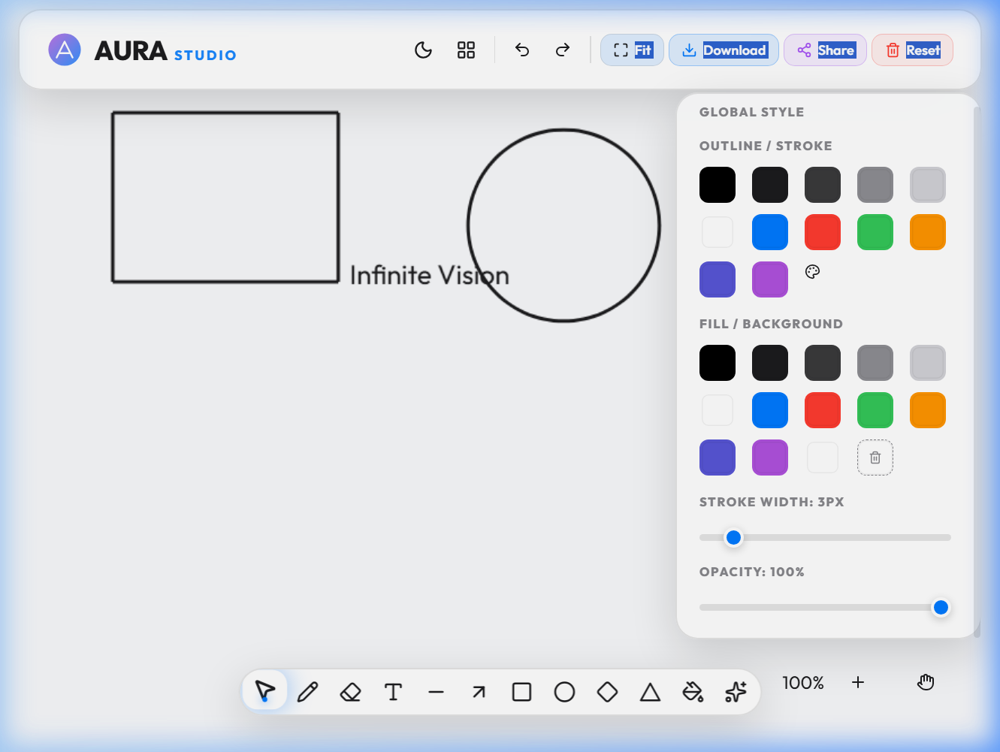

# 🌌 AURA Studio : The Infinite Creative Suite

<p align="center">
  <defs><linearGradient id='g' x1='0%25' y1='0%25' x2='100%25' y2='100%25'><stop offset='0%25' style='stop-color:%23af52de;stop-opacity:1'/><stop offset='100%25' style='stop-color:%23007aff;stop-opacity:1'/></linearGradient></defs><circle cx='50' cy='50' r='45' fill='url(%23g)' opacity='0.8'/><path d='M28 72L50 28L72 72 M36 60L64 60' stroke='white' stroke-width='6' fill='none' stroke-linecap='round' stroke-linejoin='round'/></svg>" width="120" height="120" />
</p>

<p align="center">
  
  
  
</p>

---

## 🎨 Visual Preview



> **"Experience the Art of the Infinite."**  
> AURA Studio is a professional-grade vector drawing application that redefines the digital canvas. Designed for artisans, engineers, and visionaries, AURA provides a boundless environment where ideas flow without compromise.

---

## 🎨 Mastery of the Canvas

### ✨ Infinite Vision
Your creativity doesn't fit in a box. AURA provides an **unrestricted worksheet** that expands infinitely in all directions. Pan, zoom, and explore your vision with zero pixel limits.

### 🖌️ Ethereal Vector Engine
*   **Aura Transform Engine**: Professional 8-point transformation handles for every object. Resize, scale, and manipulate shapes and text with mathematical precision.
*   **Magic Pen (Auto-Draw)**: Sketch loose ideas and watch them instantly transmute into perfect geometric shapes using our intelligent recognition system.
*   **Smart Bucket**: Effortlessly fill backgrounds and objects with curated, harmonious gradients and tints designed for modern aesthetics.

---

## 🚀 Pro Features at a Glance

| Feature | Description |
| :--- | :--- |
| **Infinite Sheet** | Full navigation mastery with zero boundaries. |
| **Asset Library** | A curated collection of stamps, emojis, and high-fidelity components. |
| **Arrangement HUD** | Advanced layering system: Front, Back, Forward, and Backward. |
| **Export Suite** | Save your masterpieces in high-quality PNG or print-ready PDF formats. |
| **Dark Mode** | A cinematic, eye-friendly theme for deep creative focus. |

---

## 🛠️ The Tech Stack

*   **React 18** - Theory meets scale.
*   **Rough.js** - Human-centric vector aesthetics.
*   **Framer Motion** - Cinematic UI choreography.
*   **Canvas API** - High-performance pixel manipulation.
*   **Lucide React** - Precision iconography.

---

## ⚡ Ignition Sequence

1.  **Clone & Install**
    ```bash
    git clone https://github.com/sumitsharma29/aura-studio.git
    npm install
    ```
2.  **Launch the Studio**
    ```bash
    npm run dev
    ```

---

<p align="center">
  <b>AURA Studio • Infinite Edition</b><br>
  <i>Elevate your creativity to the ZENITH.</i>
</p>
